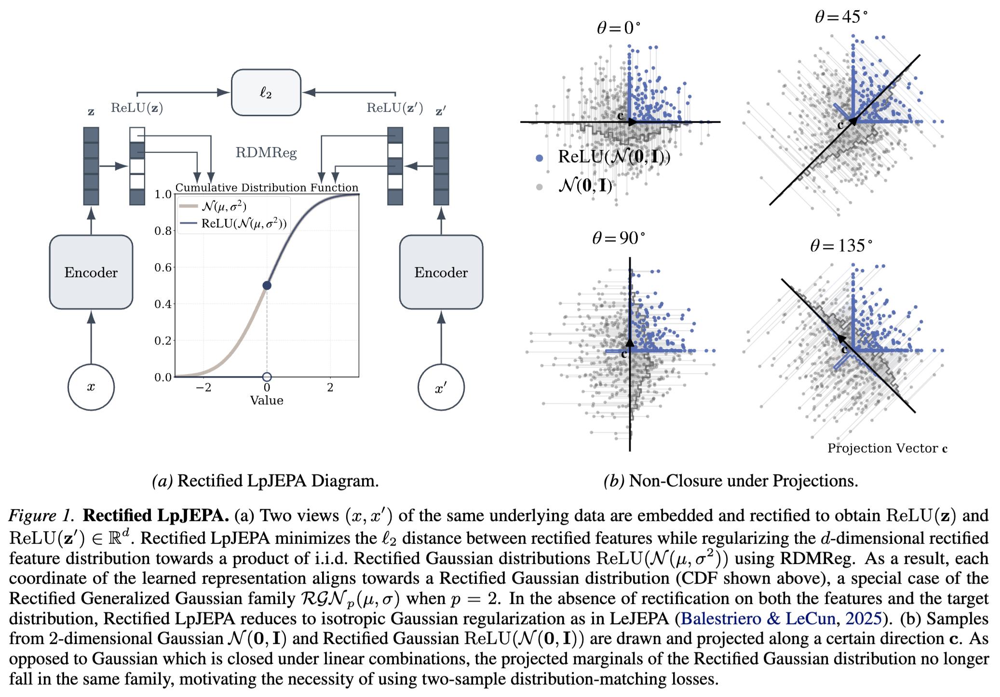

# Rectified LpJEPA

<p align="left">
  <a href="https://arxiv.org/abs/2602.01456">
    
  </a>
  <a href="https://yilunkuang.github.io/blog/2026/rectified-lp-jepa/">
    
  </a>
</p>


This repository contains the code for **Rectified LpJEPA: Joint-Embedding Predictive Architectures with Sparse and Maximum-Entropy Representations** ([arXiv](https://arxiv.org/abs/2602.01456), [blog post](https://yilunkuang.github.io/blog/2026/rectified-lp-jepa/)).


<!-- --- -->

## Overview

**Rectified LpJEPA** is a Joint-Embedding Predictive Architecture (JEPA) that learns sparse, non-negative, maximum-entropy representations by aligning features to a **Rectified Generalized Gaussian** distribution using **Rectified Distribution Matching Regularization (RDMReg)**. 

By aligning features to a Rectified Generalized Gaussian distribution, RDMReg provides explicit control over the **expected $\ell_0$ sparsity** while preserving the **maximum-entropy** property, up to rescaling, under **expected $\ell_p$-norm constraints**. This results in <u>favorable sparsity-performance trade-offs</u>, enabling <u>highly sparse representations</u> while <u>preserving task-relevant information</u>.

<div align="center">
  
</div>


## Installation

Install the required dependencies using:
```bash
pip install -r requirements.txt
```

## Core Rectified LpJEPA Code

The core Rectified LpJEPA implementations can be found in `solo/losses/rectified_lpjepa.py` and `solo/methods/rectified_lpjepa.py`.


## Rectified LpJEPA Pretraining over CIFAR-100

See [MINIMAL.md](MINIMAL.md) for a standalone implementation of Rectified LpJEPA training over CIFAR-100.

## Rectified LpJEPA Pretraining over ImageNet-100

### Default Script

To pretrain a Rectified LpJEPA model over ImageNet-100 with a ResNet-50 backbone, run

```bash
python3 main_pretrain.py \
  --config-path scripts/pretrain/imagenet-100/ \
  --config-name=rectified_lpjepa_imagenet.yaml \
  ++wandb.entity=<ENTITY> \
  ++wandb.project=<PROJECT> \
  ++wandb.enabled=true # set to false for debugging
```

By default, `rectified_lpjepa_imagenet.yaml` sets the target distribution to be the Rectified Generalized Gaussian distribution with location parameter $\mu=0$, scale parameter $\sigma_{\text{GN}}=1/\sqrt{2}$, and $\ell_p$ parameter $p=1$. The target distribution in this case is also called the Rectified Laplace distribution, which is our default choice. 

To use another target distribution within the Rectified Generalized Gaussian family, consider running the following script:

### Script with Varying Target Distributions

```bash
python3 main_pretrain.py \
  --config-path scripts/pretrain/imagenet-100/ \
  --config-name=rectified_lpjepa_imagenet.yaml \
  ++method_kwargs.lp_norm_parameter=2.0 \
  ++method_kwargs.mean_shift_value=-1.0 \
  ++wandb.entity=<ENTITY> \
  ++wandb.project=<PROJECT> \
  ++wandb.enabled=true # set to false for debugging
```

where we update the target distribution to be the Rectified Gaussian distribution with location parameter $\mu=-1$, scale parameter $\sigma_{\text{GN}}$, and $\ell_p$ parameter $p=2$. By definition, $\sigma_{\text{GN}}=\Gamma(1/p)^{1/2}/(p^{1/p}\cdot\Gamma(3/p)^{1/2})$, where $\Gamma(\cdot)$ is the Gamma function. When $p=2$, $\sigma_{\text{GN}}=1.0$.


### Varying Both Target Distributions and Other Hyperparameters

Common tunable hyperparameters include `++method_kwargs.invariance_loss_weight`, `++method_kwarsg.rdm_reg_loss_weight`, which are hyperparameters for the invariance and the RDMReg loss respectively. The learning rates `++optimizer.lr` and `++optimizer.classifier_lr` can also be changed accordingly. One example script to include all these arguments is

```bash
python3 main_pretrain.py \
  --config-path scripts/pretrain/imagenet-100/ \
  --config-name=rectified_lpjepa_imagenet.yaml \
  ++method_kwargs.lp_norm_parameter=2.0 \
  ++method_kwargs.mean_shift_value=-1.0 \
  ++method_kwargs.invariance_loss_weight=25.0 \
  ++method_kwarsg.rdm_reg_loss_weight=125.0 \
  ++optimizer.lr=0.165 \
  ++optimizer.lr=0.055 \
  ++wandb.entity=<ENTITY> \
  ++wandb.project=<PROJECT> \
  ++wandb.enabled=true # set to false for debugging
```


<!-- For a complete SLURM-ready reproduction script, refer to:
`sbatch_scripts/imagenet_torch_run.sh`

```bash
python3 main_pretrain.py \
  --config-path scripts/pretrain/imagenet-100/ \
  --config-name=rectified_lpjepa_imagenet.yaml \
  ++method="rectified_lpjepa" \
  ++method_kwargs.mean_shift_value=-1.0
``` -->


## Acknowledgements

This codebase is built upon the [solo-learn](https://github.com/vturrisi/solo-learn) framework.
We thank the solo-learn authors for releasing their code under the MIT license.

## Citation
Please cite our work if you find it helpful:
```bibtex
@misc{kuang2026rectifiedlpjepajointembeddingpredictive,
      title={Rectified LpJEPA: Joint-Embedding Predictive Architectures with Sparse and Maximum-Entropy Representations}, 
      author={Yilun Kuang and Yash Dagade and Tim G. J. Rudner and Randall Balestriero and Yann LeCun},
      year={2026},
      eprint={2602.01456},
      archivePrefix={arXiv},
      primaryClass={cs.LG},
      url={https://arxiv.org/abs/2602.01456}, 
}
```

